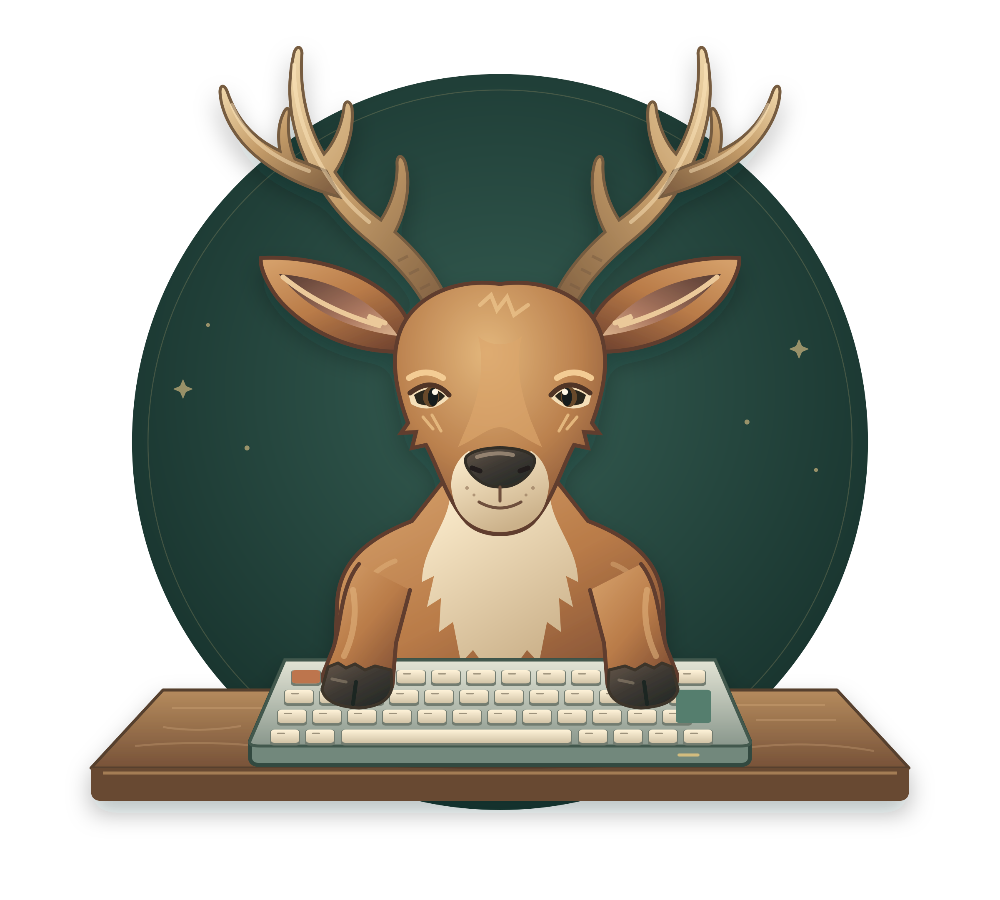
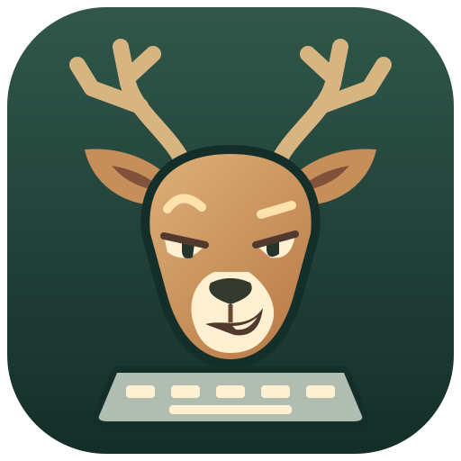

# KeyboarDeer

### A little wild. A little wired.

**A visual configurator for KMonad.**

Your keyboard. Your habits. Your natural habitat.

[The idea](#give-your-keyboard-a-new-instinct) · [Project status](#still-growing-its-antlers) · [Artwork](#meet-the-deer) · [Get involved](#pull-up-a-chair)

---

## Give your keyboard a new instinct

The right layout makes a keyboard feel like an extension of your hands.
Getting there should feel just as natural.

KeyboarDeer is a planned graphical companion for
[KMonad](https://github.com/kmonad/kmonad) and
[KMonad Device Manager](https://github.com/lukelex/kmonad-device-manager).
The goal: make keyboard configuration something you can see, understand,
and shape—one key at a time.

### What we're working toward

- **See your layout.** A visual home for key mappings and layers.
- **Know your keyboard.** Clear device selection and per-keyboard configuration.
- **Make changes with confidence.** Validation and useful feedback before applying a mapping.
- **Close the window. Keep typing.** The device manager remains an independent
  service, supervising your mappings even when the GUI is closed.

These are design goals, not currently available features.

## Still growing its antlers

**Status: concept and branding.** This repository currently contains the
project identity, original logo artwork, and initial product direction.
There is no installable application yet; a GUI toolkit and implementation
language have not been selected.

The next milestones are:

- [ ] Explore the first-run flow: discover a keyboard and understand its current state.
- [ ] Choose the GUI stack and establish an accessible visual foundation.
- [ ] Connect a read-only device view to the device manager's local API.
- [ ] Design the edit → validate → apply workflow around safe, per-keyboard updates.

The guiding principle is simple: **the GUI is a companion; the service keeps
the keyboards running.**

## Meet the deer

One raised eyebrow. A proper set of antlers. One very deliberate keypress.

The KeyboarDeer mascot mixes natural deer features with a warm, illustrated
character: a long muzzle, branching antlers, soft fur shading, and a
mischievous smirk. Head propped in one hoof, the deer presses a key with the
other. A wooden tabletop and a mechanical keyboard bring the woodland and
the workstation together.

The name is written **KeyboarDeer**—the capital **D** helps the pun peek out.

| | Color | Hex |
| --- | --- | --- |
| Forest | Deep green | `#142e29` |
| Chestnut | Warm coat | `#b97b48` |
| Cream | Soft highlights | `#fff0d1` |
| Sage | Keyboard accents | `#557e6e` |
| Antler | Muted gold | `#c49c69` |

The [editable SVG](assets/logo.svg) is the source artwork. The
[high-resolution PNG](assets/logo.png) is used above for consistent rendering.
See [the artwork notes](assets/README.md) for export instructions.

### Small icon, same attitude

The [app icon](assets/icon.svg) keeps the antlers, crooked grin, and keyboard
in a compact silhouette for smaller placements.

## Pull up a chair

Have an opinion about visual layout editors, layers, accessibility, or what
makes a keyboard feel right? [Open an issue](https://github.com/lukelex/keyboardeer/issues).
Concrete workflows and sketches are especially welcome at this stage.

For the service that actually supervises KMonad processes, visit
[KMonad Device Manager](https://github.com/lukelex/kmonad-device-manager).

## License

[MIT](LICENSE), including the original artwork in this repository.

---

Made for creatures of habit. And people who remap them.

