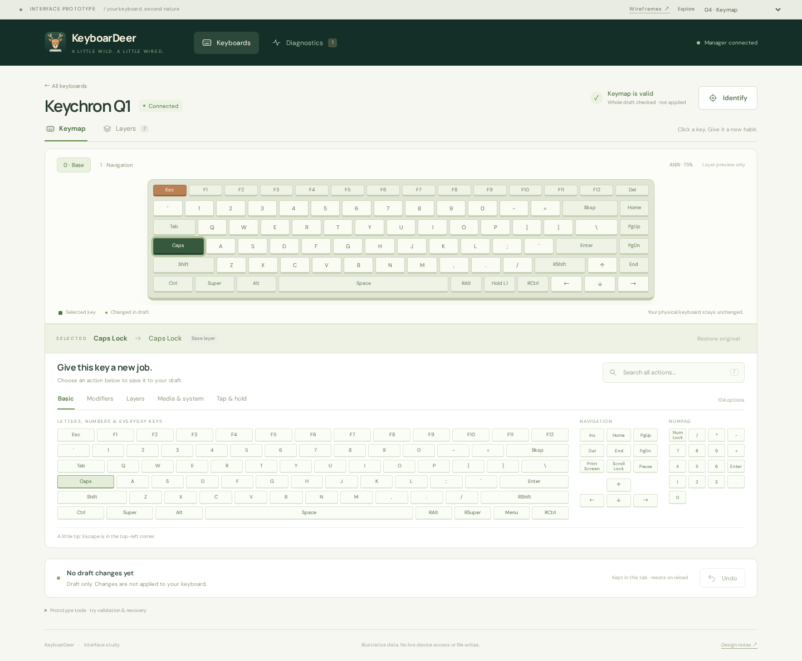
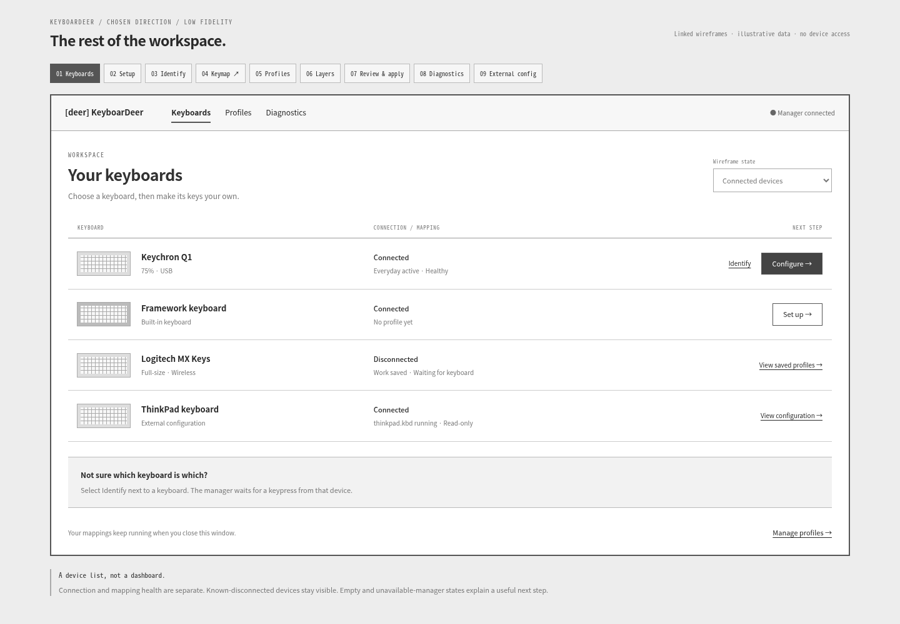

# Interface direction

**Chosen direction: VIA/Vial-inspired keyboard canvas with a bottom action
palette.** The surrounding pages follow the same compact, full-width layout,
with context and actions below the main content.

Start with the **[current high-fidelity workspace](high-fidelity-workspace.html)**.
Use its **Explore** selector to browse all seven screens, or follow the normal
device → setup/identify → keymap → layers navigation.

**Current scope:** Keyboards, Setup, Identify, Keymap, Layers, Diagnostics,
External configuration, and Preferences. **Profiles and Review & Apply are parked.** The current
prototype has no navigation or actions for either. Changes stay in per-keyboard,
in-memory drafts and are explicitly not applied.

The earlier [application wireframes](low-fidelity-pages.html) and
[bottom-palette wireframe](low-fidelity-palette.html) document the low-fidelity
exploration. The former includes parked screens as historical design references.

Earlier explorations are retained for comparison:
[original wireframes](low-fidelity.html) and
[original high-fidelity prototype](high-fidelity.html). Their side-panel editor
is superseded by the current bottom-palette workspace.

Open the HTML files in a browser, or serve the repository root:

```sh
python3 -m http.server 8000
```

Visit `http://localhost:8000/docs/design/high-fidelity-workspace.html`. No build
or package installation is needed. The high-fidelity design uses optional Google
Fonts (Manrope and DM Sans) with local sans-serif fallbacks. The low-fidelity
files use system fonts only.

## Current high-fidelity screens

| Screen | Interactive page | PNG preview |
| --- | --- | --- |
| Keyboards | [Open](high-fidelity-workspace.html#keyboards) | [View](previews/high-keyboards.png) |
| Setup | [Open](high-fidelity-workspace.html#setup) | [View](previews/high-setup.png) |
| Identify | [Open](high-fidelity-workspace.html#identify) | [View](previews/high-identify.png) |
| Keymap | [Open](high-fidelity-workspace.html#keymap) | [View](previews/high-keymap.png) |
| Layers | [Open](high-fidelity-workspace.html#layers) | [View](previews/high-layers.png) |
| Diagnostics | [Open](high-fidelity-workspace.html#diagnostics) | [View](previews/high-diagnostics.png) |
| External configuration | [Open](high-fidelity-workspace.html#external) | [View](previews/high-external.png) |

[Compact editor preview](previews/high-compact.png)



### Visual system and interactions

- Forest navigation, ivory surfaces, sage controls, amber draft markers, and
  tactile keycaps. Headings and generous spacing distinguish tasks without a
  large permanent sidebar.
- The editor exposes 104 basic actions in recognizable keyboard/navigation/numpad
  groups. Category tabs expose modifiers, layers, media, and tap/hold presets.
- Click a source key, then an action. Search spans categories; `/` focuses it.
  Restore and undo update the draft. The footer distinguishes draft changes
  from live keyboard state.
- Every semantic edit automatically validates the **whole draft**. A subtle
  **Keymap is valid** check sits beside the title. Invalid assignments get a
  prominent panel with causes/remedies, marked keys and layer-tab issue counts,
  **Show key**, and **Revert [key]**. Reverting restores that key's last validated
  value while keeping other edits, then rechecks the draft. Results are revision-
  and environment-bound; blocked/unavailable checks never claim validity.
- Layer changes integrate with the editor and its palette. Add/rename a layer,
  assign an entry action, and see reachability update. Starter Base/Navigation
  layers are fixed examples; added layers can be deleted after removing entry
  references. These edits participate in undo.
- Drafts are independent for Keychron and Framework in the current browser tab.
  Setup opens the selected device directly, without a profile-creation step.
  Only the illustrative ANSI 75% canvas is supported; other geometry cards are
  marked as previews.
- Identify has a 15-second countdown, success, timeout, cancellation, unplug,
  and simulated reconnect. It never captures real typing.
- Preview selectors show empty inventory, lost manager connection, permission
  problems, healthy diagnostics, and incomplete API. Unknown runtime state is
  labeled explicitly; local draft editing remains available.
- External configuration source remains read-only. Explicit manager-validated
  adoption is supported; it does not overwrite source or visually import syntax.
  is exposed. Its source panel is illustrative and still depends on a future
  manager content-read API.

All state is simulated and resets on reload. There are no manager calls or
filesystem writes. The **Explore** selector and preview-state selectors are
prototype tools, not proposed production navigation.

### Try live validation and recovery

1. Open the keymap and assign **Escape** to **Caps Lock**. Wait for the quiet
   **Keymap is valid** status.
2. Expand **Prototype tools · try validation & recovery** below the draft footer
   and choose **Assign missing layer**. The selected key becomes invalid, with
   an explanation and **Revert Caps Lock** back to the validated Escape action.
3. Select **A**, assign **Tab**, then select **B** and choose **Assign undefined
   alias**. The panel lists both bad assignments. Reverting one preserves the
   other error and the valid A → Tab edit.
4. Try an issue on another layer and use **Show key** to jump to it. Use Undo
   after a revert to inspect the earlier invalid draft again.
5. Use the simulated-validator selector for blocked, timed-out, and unattributed
   rejection states. Environment problems do not blame keys; unmapped errors do
   not offer an invented key-level revert.

The simulation recognizes the injected missing-layer/alias fixtures, not arbitrary
KMonad syntax. Production scheduling, source mapping, result identity, and recovery
semantics are specified in the [live-validation plan](../live-validation.md).

[Invalid-key recovery preview](previews/high-keymap-invalid.png) ·
[Blocked validation preview](previews/high-keymap-blocked.png)

## Earlier low-fidelity previews

[Keymap with bottom palette](previews/low-fidelity-palette.png)

| Page | Interactive wireframe | PNG preview | Purpose |
| --- | --- | --- | --- |
| 01 Keyboards | [Open](low-fidelity-pages.html#keyboards) | [View](previews/flow-keyboards.png) | Device selection, connection versus mapping health, external ownership. |
| 02 Setup | [Open](low-fidelity-pages.html#setup) | [View](previews/flow-setup.png) | Choose physical geometry and name a draft before editing. |
| 03 Identify | [Open](low-fidelity-pages.html#identify) | [View](previews/flow-identify.png) | Keypress confirmation, countdown, cancel, and recovery. |
| 04 Keymap | [Open](low-fidelity-palette.html) | [View](previews/low-fidelity-palette.png) | Select a physical key, then click an action below. |
| 05 Profiles | [Open](low-fidelity-pages.html#profiles) | [View](previews/flow-profiles.png) | Local drafts separate from active runtime revisions. |
| 06 Layers | [Open](low-fidelity-pages.html#layers) | [View](previews/flow-layers.png) | Layer list, entry behavior, fall-through, and reachability. |
| 07 Review & apply | [Open](low-fidelity-pages.html#review) | [View](previews/flow-review.png) | Before/after changes, validation, explicit apply, and result. |
| 08 Diagnostics | [Open](low-fidelity-pages.html#diagnostics) | [View](previews/flow-diagnostics.png) | Manager findings with per-device remediation. |
| 09 External configuration | [Open](low-fidelity-pages.html#external) | [View](previews/flow-external.png) | Read-only runtime/source view with explicit ownership. |

Additional state previews: [no keyboards](previews/flow-empty.png),
[manager unavailable](previews/flow-offline.png),
[validation rejected](previews/flow-rejected.png), and
[activation rolled back](previews/flow-rollback.png).



The PNGs are captured from the HTML prototype. Regenerate affected previews
after visual changes; the HTML/CSS/JavaScript files are the editable source.

## The interface

### Selected keymap direction: bottom action palette

Inspired by the [Vial editor reference](https://getreuer.info/posts/keyboards/vial/vial-editor.webp):

- A full-width keyboard canvas at the top, with layer selection beside it.
- A narrow strip showing the physical key, its draft assignment, and its layer.
- A bottom palette with **Basic**, **Modifiers**, **Layers**, **Media & system**,
  and **Tap & hold** categories. Basic options use familiar keyboard positions,
  with navigation and numpad groups visible alongside them.
- Click a physical key, then an option to assign it immediately to the draft.
  The destination stays selected for quick comparisons. Changed keys display
  their new action, original key label, and a change marker.
- Search across every category (press `/` to focus search), restore the original
  assignment, undo, and review the before/after list. Layer drafts are independent.
- The selected assignment is highlighted in the palette. Arrow keys navigate
  category/layer tabs; all assignments are native buttons with accessible labels.

Open `low-fidelity-palette.html` directly, or visit
`http://localhost:8000/docs/design/low-fidelity-palette.html` when serving the
repository. Try **Caps Lock → Escape**, search **volume**, then preview the
Navigation layer or explore tap/hold combinations. Drafts reset on reload.

The bottom panel is deliberately monochrome and compact: this iteration tests
option visibility and fast assignment, not final styling. It contains a
representative catalog, not every KMonad behavior. Tap/hold entries are presets;
custom behavior builders, timing, and capability-specific availability remain
follow-up work. The editor's review dialog summarizes its actual temporary
draft and links to the separate review/apply fixture. The reference image is
linked, not redistributed.

### Surrounding pages and state coverage

The application wireframes use full-width content, small workspace navigation,
and a bottom context/action panel. There is no permanent editor inspector or
large application sidebar competing with the keyboard canvas.

- **Keyboards:** switch between normal, no-device, and manager-unavailable
  examples. Cached devices are explicitly not live runtime state.
- **Setup:** choose a layout and name a draft. ANSI 75% opens the linked editor
  with the chosen device/profile name; ISO and full-size remain illustrative
  selections until their editor geometry is designed.
- **Identify:** start a 15-second simulated session, simulate a matching key or
  unplug, cancel, or let it time out. Leaving this screen cancels the simulated
  session. It never records actual typing.
- **Profiles:** show pending edits alongside active revisions, explore rename
  and inactive duplication, and inspect the import/export workflow explanation.
  Native file operations and alternate-profile activation are design details.
- **Layers:** select a layer to see its entry/fallback behavior. Add a sample
  layer to see the unreachable state; names can be changed in the wireframe.
- **Review:** choose valid, disconnected, rejected, stale-revision, rollback,
  or applied results. Apply simulates an accepted operation; stale state requires
  refreshing the comparison before retrying. This page uses a fixed two-change
  example and does not import the palette editor's in-memory assignments.
- **Diagnostics:** explore permission problems, healthy state, missing manager,
  and incomplete API. Unknown health never appears as healthy.
- **External:** show read-only source and runtime details. A new visual draft is
  separate from adoption and does not take over a claimed device automatically.
- **Preferences:** choose an optional folder for editable profile JSON. The
  prototype remembers the setting locally; folder access and profile file syncing
  are illustrative and do not write files or interact with Git.

The linked pages are design fixtures, not a shared persistent application store.
Refreshing resets examples. Numbered gallery navigation and result selectors
are review tools, not proposed production navigation. These screens describe
target UX, including manager methods that are still upstream dependencies; see
the [API audit](../manager-api-status.md).

### Original side-panel direction (superseded)

1. **Keyboards:** calm device list, one primary action per keyboard. Show
   connection state separately from profile activity. Retain disconnected
   keyboards. No dashboard or unnecessary statistics.
2. **Editor:** the keyboard is the main canvas, layer previews sit above it,
   and a right-hand panel edits the selected key. Click-to-assign makes
   drag-and-drop optional. Simple remaps first, tap-and-hold on demand.
3. **Review:** readable before/after assignments, preview validation, then one
   explicit apply action. Keep draft, validation, and live runtime state distinct.

Forest-green navigation anchors an ivory workspace. Muted sage frames the
keycaps; amber marks draft edits. Typography pairs Manrope headings with DM Sans
controls. The small deer icon supplies personality without crowding the editor.

## Try the original high-fidelity prototype

- Configure Keychron Q1, select Caps Lock, choose Tap & hold, then Escape and
  Control. Save to draft, review, and apply.
- Select another key or layer, change its assignment, and undo the edit.
- Use Identify and simulate a keypress, cancel, or wait for its timeout.
- Set up the Framework profile, or view the disconnected Logitech profile.
- Use the scenario selector to explore manager unavailability, disconnection,
  validation rejection, rollback, and unsupported features.
- Open Help to see the short onboarding explanation.

All data and operations are simulated. Drafts are per device, kept only in
memory, and reset on reload. The prototype is not a manager client or an
implementation of its API. The keyboard canvas is illustrative ANSI 75%; the
laptop and full-size devices reuse it to demonstrate navigation. Geometry
selection beyond that canvas is a follow-up design.

## Design acceptance and follow-up

- Keep one primary action per context and place its outcome next to it.
- Never use color alone: selected keys, changed keys, and status badges also
  have accessible labels or explanatory text.
- Preserve visible focus, native controls, modal focus containment, and reduced
  motion. Validate actual contrast and screen-reader behavior in the application;
  small prototype annotations are not final production typography.
- Keep a draft editable when disconnected; applying requires successful manager
  validation and the relevant capability.
- Expand the design for external read-only configs, structured diagnostics,
  stale-revision review, multiple profiles, exact layouts, aliases/macros,
  import/export, and lifecycle actions during implementation.
- Test usability with someone unfamiliar with KMonad: can they remap Caps Lock,
  explain whether it is live, and recover from a blocked apply unaided?

The production app will use Wails, Go, Svelte 5, and TypeScript. These dependency-
free HTML/CSS/JavaScript mockups are design artifacts, not a new stack decision.

## Verification

The current high-fidelity workspace was checked in Chromium for all seven routes,
104-key palette visibility, assignment/restore/undo, global search, tab keyboard
navigation, tap/hold presets, per-device draft isolation, setup context, layer
entry detection and safe removal, identification, and unavailable/incomplete API
states. All screens were checked at 390px width for page-level overflow. These
are prototype checks, not production accessibility or API conformance claims.
Live-validation checks also cover stale responses, cross-device results, checkpoint
recovery, preservation of unrelated edits and errors, targeted revert/undo,
cross-layer issue navigation, and environmental versus unattributed failures.

The chosen low-fidelity flow was checked in Chromium: all eight companion
routes, setup-to-editor device/profile context, empty/offline states, identification
success/cancel/disconnect, profile duplication, layer creation/reachability,
validation rejection, blocked apply, stale-revision refresh, apply success, and
rollback. Every companion screen was checked at 390px width for page-level
horizontal overflow. The palette editor retains its assignment/search/undo checks.

The prototype was exercised in headless Chromium at desktop and 390px widths:
draft save, apply, undo, blocked/rejected previews, rollback, identification,
unavailable/limited-manager actions, and new-profile setup. Those flows passed
without page errors or page-level horizontal overflow at the compact size.
Production API and accessibility acceptance remain in the application checklist.
