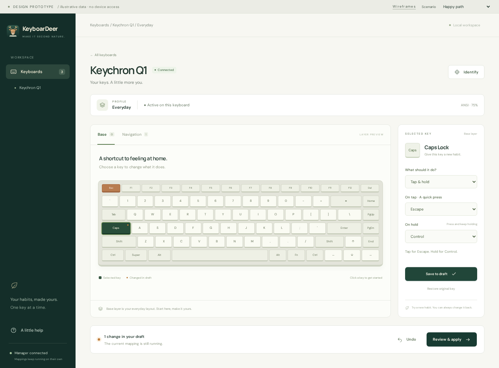

# Interface direction

Design sequence: [low-fidelity wireframes](low-fidelity.html), then the
[high-fidelity interactive prototype](high-fidelity.html).

Open either HTML file in a browser, or serve the repository root:

```sh
python3 -m http.server 8000
```

Visit `http://localhost:8000/docs/design/low-fidelity.html`, then follow the
high-fidelity link. No build or package installation is required. The prototype
uses optional Google Fonts with sans-serif fallbacks.

## Preview without running anything

[Low-fidelity sheet](previews/low-fidelity.png) ·
[Devices](previews/devices.png) · [Editor](previews/editor.png) ·
[Review](previews/review.png) · [Compact layout](previews/compact.png)



The PNGs are captured from the HTML prototype. Regenerate affected previews
after visual changes; the HTML/CSS/JavaScript files are the editable source.

## The interface

1. **Keyboards:** calm device list, one primary action per keyboard. Show
   connection state separately from profile activity. Retain disconnected
   keyboards. No dashboard or unnecessary statistics.
2. **Editor:** the keyboard is the main canvas, layer previews sit above it,
   and a right-hand panel edits the selected key. Click-to-assign makes
   drag-and-drop optional. Simple remaps first, tap-and-hold on demand.
3. **Review:** readable before/after assignments, preview validation, then one
   explicit apply action. Keep draft, validation, and live runtime state distinct.

Forest-green navigation anchors an ivory workspace. Muted sage frames the
keycaps; amber marks draft edits. Typography pairs Manrope headings with DM Sans
controls. The small deer icon supplies personality without crowding the editor.

## Try the prototype

- Configure Keychron Q1, select Caps Lock, choose Tap & hold, then Escape and
  Control. Save to draft, review, and apply.
- Select another key or layer, change its assignment, and undo the edit.
- Use Identify and simulate a keypress, cancel, or wait for its timeout.
- Set up the Framework profile, or view the disconnected Logitech profile.
- Use the scenario selector to explore manager unavailability, disconnection,
  validation rejection, rollback, and unsupported features.
- Open Help to see the short onboarding explanation.

All data and operations are simulated. Drafts are per device, kept only in
memory, and reset on reload. The prototype is not a manager client or an
implementation of its API. The keyboard canvas is illustrative ANSI 75%; the
laptop and full-size devices reuse it to demonstrate navigation. Geometry
selection beyond that canvas is a follow-up design.

## Design acceptance and follow-up

- Keep one primary action per context and place its outcome next to it.
- Never use color alone: selected keys, changed keys, and status badges also
  have accessible labels or explanatory text.
- Preserve visible focus, native controls, modal focus containment, and reduced
  motion. Validate actual contrast and screen-reader behavior in the application;
  small prototype annotations are not final production typography.
- Keep a draft editable when disconnected; applying requires successful manager
  validation and the relevant capability.
- Expand the design for external read-only configs, structured diagnostics,
  stale-revision review, multiple profiles, exact layouts, aliases/macros,
  import/export, and lifecycle actions during implementation.
- Test usability with someone unfamiliar with KMonad: can they remap Caps Lock,
  explain whether it is live, and recover from a blocked apply unaided?

The production app will use Wails, Go, Svelte 5, and TypeScript. These dependency-
free HTML/CSS/JavaScript mockups are design artifacts, not a new stack decision.

## Verification

The prototype was exercised in headless Chromium at desktop and 390px widths:
draft save, apply, undo, blocked/rejected previews, rollback, identification,
unavailable/limited-manager actions, and new-profile setup. Those flows passed
without page errors or page-level horizontal overflow at the compact size.
Production API and accessibility acceptance remain in the application checklist.
